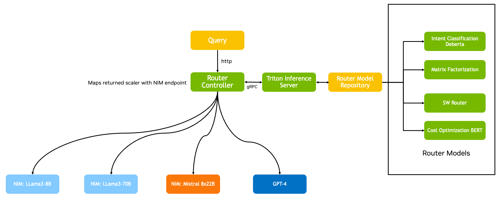
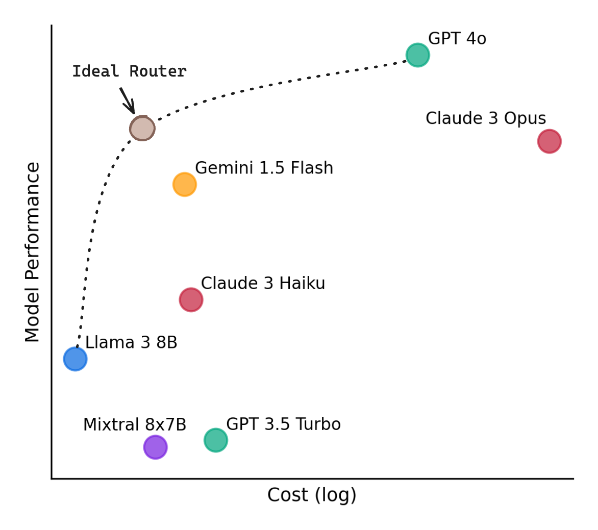

# LLM Router

This demo shows users how a LLM-router model can be used to dynamically assess incoming queries from a user and direct them to the most appropriate language model accordingly. Based on the complexity of the query, the LLM-router model will decide whether to utilize a high-performance, proprietary LLM or a more cost-efficient, open-source alternative.

NIM LLM Router has a reverse proxy, OpenAI OpenAPI compatible server that:

* receives any OpenAI compatible request (unary or streaming),
* parses the payload of that request,
* sends the parsed data to some "policy/decision making model",
* receives results of that "policy/decision making model",
* routes the request to the resulting LLM model,
* returns the results to the initial client.




Using the above, we can route simple queries like "Hello! How are you?" to smaller yet capable models like llama3-8b. And route complex queries like "Write a thesis on Bell's theorem." to stronger yet more expensive models like GPT4 or Llama3-405B. This work builds off the [work of RouteLLM](https://lmsys.org/blog/2024-07-01-routellm/):


> We trained four different routers using public data from Chatbot Arena and demonstrate that they can significantly reduce costs without compromising quality, with cost reductions of over 85% on MT Bench, 45% on MMLU, and 35% on GSM8K as compared to using only GPT-4, while still achieving 95% of GPT-4’s performance.




As of today we support:

* ✅ Completions and ChatCompletions endpoints
* ✅ HTTP and HTTPS
* ✅ Unary and Streaming


## Requirements
1. **Before cloning this repository, make sure `LFS` is initialized with `git lfs install`**
1. Docker
1. Docker Compose
1. NVIDIA API Key from [build.nvidia.com](https://build.nvidia.com/)

## App Demo Quick Start

To run the app UI demo, please bring up the `model-server`, `router-controller` and `app` containers, making required changes described in [Required Container Changes](#required-container-changes) and [App Demo Container Requirements UI](#app-demo-container-requirements-ui) beforehand.

`docker compose build model-server router-controller app`

`docker compose up -d model-server router-controller app`

With default port values, the app gradio can be found at http://127.0.0.1:8008.

Do any [Docker Container sanity checks](#docker-container-sanity-checks) as necessary.

## Demo Endpoints
If all demos are running, here are the following relevant endpoints:

### App Demo

The app gradio can be found at http://127.0.0.1:8008.

## Bring-Up
### Docker Container Required Changes

**Please make the required changes to the containers that you would like to bring-up accordingly before building the containers.**

The Triton `model-server` container and Rust-based `router-controller` containers are required for all LLM-router deployments.

If you would like to bring up the App UI demo or cost dashboard demo, please make the changes to the relevant containers, as described below.

#### Required Container Changes
##### Triton for Router Model(s) Deployment

- In `docker-compose.yaml`, modify the value of `--load-model` with the router-model folder name from `/model_repository` that you would like to load. `task_router_ensemble` is selected by default.

- If you require a call to [build.nvidia.com](https://build.nvidia.com/), in `/docker/triton.dockerfile` replace and uncomment `NVIDIA_API_KEY=nvapi-YOURKEYHERE` with your `NVIDIA_API_KEY` from [build.nvidia.com](https://build.nvidia.com/).
> *Please note: The value of `NVIDIA_API_KEY` is "`nvapi-YOURKEYHERE`" by default, please ensure you add your API Key before running the demo with a model that requires it, or else it will fail.*

##### Router Controller Bring-up
Edit the `router_controller/config.yaml` file. You may need to modify the `url` in the router `policy` section to the public IP of the Triton server deploying your router. 

If necessary, modify the `api_key` section of your models to your API Key(s) for the endpoint LLMs - these are the list of models where your query can be sent after it is processed by the router model for cost efficiency.

**Please note** that the example router policy ([Task Classifier](https://huggingface.co/nvidia/prompt-task-and-complexity-classifier) in this case) is returning raw logits, and expects the order of the models in the config to also be order-specific. This config can also be modified to use locally-hosted models or other APIs such as gpt4.

###### Example `router_controller/config.yaml`: 

Task Classifier is trained to predict the task type of the incoming query as Brainstorming, Chatbot, Classification, Closed QA, Code Generation, Extraction, Open QA, Other, Rewrite, Summarization, Text Generation, and Unknown, respectively. So the order of the logits is: ["Brainstorming":0.6,"Chatbot":0.35, "Classification":0.15, "Closed QA":0.0, "Code Generation":0.0,"Extraction":0.0, "Open QA":0.0," Other":0.0, "Rewrite":0.0, "Summarization":0.0, "Text Generation":0.0, "Unknown":0.0], so the config should be ordered as:
> For demo simplicity and cost purposes for development, any queries that should be routed to `meta/llama-3.1-70b-instruct` in this case. This can be changed as needed.
```yaml
policy:
  url: http://127.0.0.1:8000/v2/models/task_router_ensemble/infer
llms:
  - name: Brainstorming
    api_base: https://integrate.api.nvidia.com
    api_key: ""
    model: meta/llama-3.1-70b-instruct

  - name: Chatbot
    api_base: https://integrate.api.nvidia.com
    api_key: ""
    model: mistralai/mixtral-8x22b-instruct-v0.1

  - name: Classification
    api_base: https://integrate.api.nvidia.com
    api_key: ""
    model: meta/llama-3.1-8b-instruct

  - name: Closed QA
    api_base: https://integrate.api.nvidia.com
    api_key: ""
    model: meta/llama-3.1-70b-instruct

  - name: Code Generation
    api_base: https://integrate.api.nvidia.com
    api_key: ""
    model: mistralai/mixtral-8x22b-instruct-v0.1

  - name: Extraction
    api_base: https://integrate.api.nvidia.com
    api_key: ""
    model: meta/llama-3.1-8b-instruct

  - name: Open QA
    api_base: https://integrate.api.nvidia.com
    api_key: ""
    model: meta/llama-3.1-70b-instruct

  - name: Other
    api_base: https://integrate.api.nvidia.com
    api_key: ""
    model: mistralai/mixtral-8x22b-instruct-v0.1

  - name: Rewrite
    api_base: https://integrate.api.nvidia.com
    api_key: ""
    model: meta/llama-3.1-8b-instruct

  - name: Summarization
    api_base: https://integrate.api.nvidia.com
    api_key: ""
    model: meta/llama-3.1-70b-instruct

  - name: Text Generation
    api_base: https://integrate.api.nvidia.com
    api_key: ""
    model: mistralai/mixtral-8x22b-instruct-v0.1

  - name: Unknown
    api_base: https://integrate.api.nvidia.com
    api_key: ""
    model: meta/llama-3.1-8b-instruct
  
```

Make sure that `SocketAddr` in `/router_controller/crates/llm-router-gateway-api/src/main.rs` is set to `0.0.0.0:8084`:

```rust

    // let addr = SocketAddr::from(([127, 0, 0, 1], 8084));
    let addr = SocketAddr::from(([0, 0, 0, 0], 8084));
```

#### App Demo Container Requirements (UI)
Make sure you have modified the following to bring up the app demo container:
- In `app/app_info.py`, modify the following: 
  - `models_list` should list all model endpoints that can receive queries based on the output of the deployed router models.
  - `policies_list` should list all routers that are actively deployed by the router controller. `manual` and `random` router models are always deployed by default.
  - `router_controller_url` should point to the URL where the router controller is deployed. Depending on your machine, you may have to use a public IP address.
  - `openai_api_key` should be changed to your OpenAI API key, if required. This is not required for the demo.


### Docker Container Build and Run

#### Development

For development, build and run a single docker image (example, Triton model-server): 
    
    docker compose up --build model-server --force-recreate

#### Production

To build a service (example, Triton model-server):

```bash
docker compose build model-server
```

To run a single service:

```bash
docker compose up model-server
```


To build all services:

```bash
docker compose build
```

To run the services:

```bash
docker compose up -d
```

If required, inspect logs:

```bash
docker compose logs -f app
```

#### To Bring Down Docker Services

```bash
docker compose down
```

### Docker Container Sanity Checks

Sanity checks are included to check that different Docker services are running correctly.

Install all required packages for all tests before doing any sanity checks:

`pip install ancillary_router_items/triton_test_script_requirements.txt`

#### Triton
1. Open another terminal on the same machine running the Triton container. Do a sanity check to make sure the Triton inference server is OK:

    Check health:

      `curl -v localhost:8000/v2/health/ready`

    Check what router models are deployed:

      `curl -X POST localhost:8000/v2/repository/index`

#### App (UI)
*Please make sure the Triton container and Rust Router Controller are up and running before testing this.*

- Run `python3 app/test_client.py`

#### Rust Router Controller

```bash
cd router_controller/utility_scripts

# take your pick, make sure the IPs and any other details for the script you are testing are edited accordinngly
bash test_router.sh
# you may need to force exit this one:
bash test_router_stream.sh
